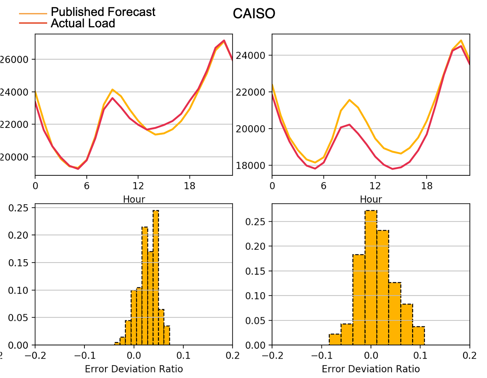
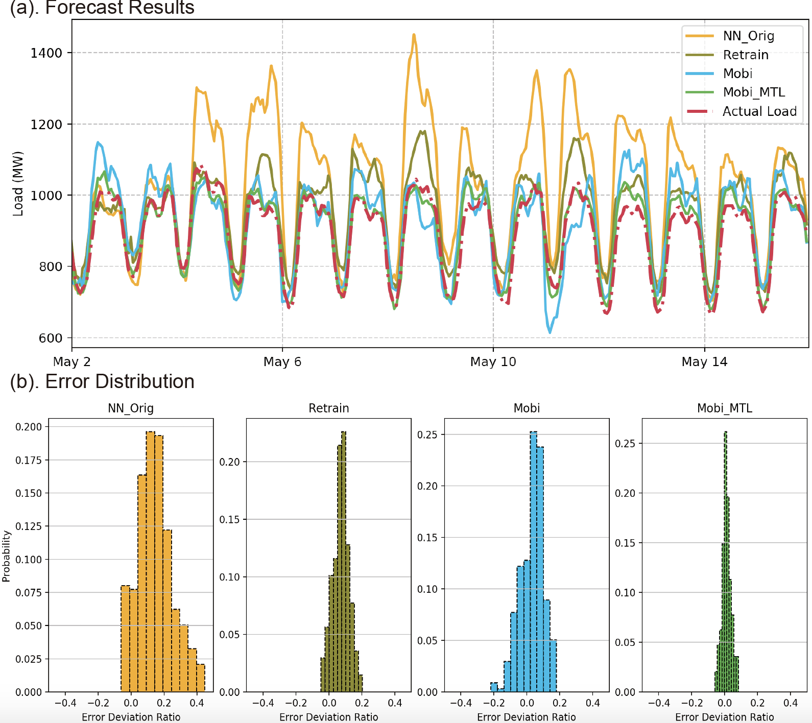

# Load-Forecasting-During-COVID-19
This is the code repo for [Using Mobility for Electrical Load Forecasting During the COVID-19 Pandemic](https://arxiv.org/abs/1707.09676)

By Yize Chen, Weiwei Yang and Baosen Zhang, 

University of Washington and Microsoft Research

The method shown in this repository can be used for improving load forecasting performance during the uncertain times due to COVID-19 pandemic.

## Introduction
The COVID-19 pandemic has brought major disruptions to the energy systems' operations. To keep the lights on during the difficult times, power system engineers rely on accurate load forecasts to schedule electricity generations. However, the change of mobility patterns, the implementations of stay-at-home orders have greatly reshaped the electricity consumption, and made an accurate forecast of future loads challenging.




## Data


## Run Experiments with Pre-Processed Datasets
Construct the dataset using features from mobility


Train the multi-task learning model based on mobility data
```
python scripts/transfer_main.py
```

Compare and plot the results of different algorithms




## Questions?

Please email [me](http://blogs.uw.edu/yizechen/) at yizechen@uw.edu if you have any code or implemenration questions!
